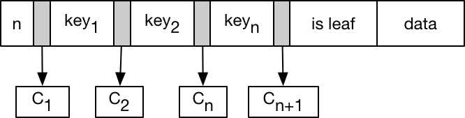
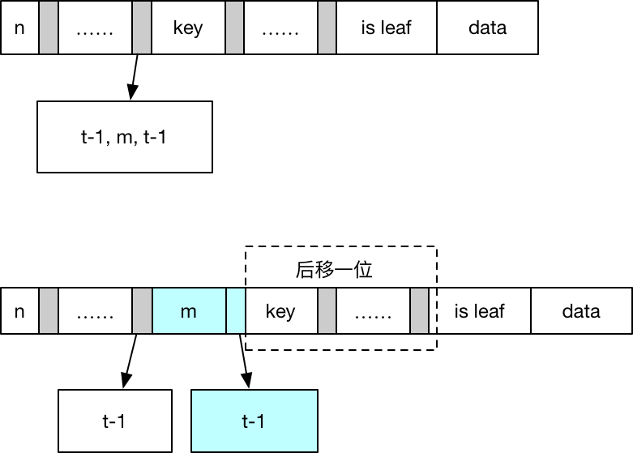

### 0. B-tree的特性

#### 算法导论中的定义

1. b-tree中节点的结构
   

* n表示节点中存储的键的个数，键有序
* $key_1, key_2…key_n$是其中的键，以升序存放
* is leaf表示节点是否为叶子节点
* 节点包含n+1个子节点
* data 键对应的值，通常是一个指向data page的指针

2. $k_i$表示第i个子节点中的任意键，则$k_1 \leq key_1 \leq k_2 \leq key_2 \leq … \leq k_n \leq key_n \leq key_(n+1)$, 从这个定义触发$key_1$既可以存在子树$C_1$中，也可以不存在其中
3. 叶子节点具有相同的深度，即树的高度h
4. 每个节点能包含的键的个数有上届和下届限制，这个届可以用树的最小度数$t \geq 2$来表示，$m=2*t$, m为偶数
   - 根节点至少包含一个关键字 
   - 非跟节点至少有t-1个关键字，也就至少有t个子节点
   - 每个节点至多有2t-1个关键字，也就是至多有2t个子节点

算法导论对b-tree的定义从最小度数出发，定义了节点能包含的子节点个数。另外一些定义则从阶数m出发，其实质是一样的。

通常b-tree的度比较大，尽量使一个节点占用一个disk page，这样树的高度比较低，在查找时可以减少io次数。

### 1. 插入：对根节点地分裂是增加b-tree高度的唯一途径

一个节点有2t-1个键时成为满节点，如果向一个满节点插入数据则会违背b-tree的性质，因此需要分裂，而分裂也只会发生在满节点上。具体看下分裂的过程，假设满节点c，父节点是p：

1. 节点c有2t-1个键，将它分成3部分：前t-1个键，中值键m，后t-1个键
2. 将节点c分裂成c1和c2，其中c1拥有前t-1个键，c2拥有后t-1个键，m放到父节点p的键中
3. 如果p节点也满了，则继续分裂

因此对一个值的插入就可能变成两次遍历：第一次找到要插入的节点；第二次如果待插入的节点满了，则需要分裂，这个分裂又可能会一直向上回溯到根节点。为了规避这个问题，在遍历的过程中如果发现节点已经满了，则直接分裂，__这样当分裂一个节点c的时候，可以保证它的父节点p一定不是满的，就不用向上回溯了__。

#### 1.1 分裂伪代码



```java
// c表示要分裂的节点，p是父节点，i是c在p中的下标
split(c, p, i) {
  c2 = allocate node();
  c2.isLeaf = c.isLeaf;
  c2.n = t - 1;
  c2.keys = c.keys[t, 2t-1]; // 将后t-1的键作为c2的键
  // 同时需要把后t个children拷贝过去
  if (! c.isLeaf) {
    c2.chilren = c.children[t, 2t];
  }
  m = c.keys[t]
  c.n = t - 1;
  
  // m放到父节点的keys[i]除，原来的[i, 2t-1]处的位置后移
  // c的位置不变，c2在i+1处，原来的[i+1, 2t]的children后移
  p.keys[i, 2t-1] >> 1;
  p.keys[i] = m;
  p.children[i+1, 2t] >> 1;
  p.children[i+1] = c2;
  p.n++;
}
```

##### 1.2 插入伪代码： 如果根节点满了，需要分裂根节点，先申请一个新节点作为根节点的父节点。b-tree高度的增加是在树的顶部而不是底部

```java
insert(root, key) {
  // root节点满了
  if (root.n = 2t-1) {
    // 申请一个新节点作为新的根节点
    new_root = allocate node();
    new_root.isLeaf = false;
    new_root.n = 0;
    new_root.children[0] = root;
    
    // 分裂根节点，增加树的高度
    split(root, new_root, 0);
    root = new_root;
  }
  
  insertNotFull(root, key);
}

insertNotFull(node, key) {
  // 数据会插入到这里，并且node is not full
  if (node.isLeaf) {
    find position and insert;
    return;
  }
  
  i = binarySerachByKey(node.keys, key);
  child = node.chilren[i];
  // 如果在插入路径上的节点已经满了，先分裂
  if (child is full) {
    split(child, node, i);
    // child代表前半部分key， next代表后半部分key，需要跟中间的m比较，看看key在哪一部分
    if (key > node.keys[i]) {
      child = node.children[i+1];
    }
  }
}
```

