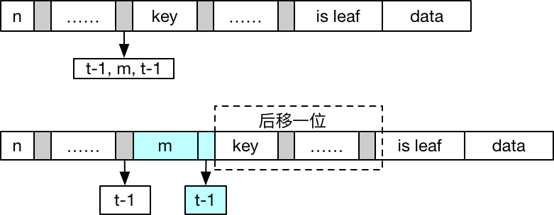

### 0. B-tree的特性

#### 算法导论中的定义

1. b-tree中节点的结构
   

* n表示节点中存储的键的个数，键有序
* $key_1, key_2…key_n$ 是其中的键，以升序存放
* is leaf表示节点是否为叶子节点
* 节点包含n+1个子节点
* data 键对应的值，通常是一个指向data page的指针

2. $k_i$表示第i个子节点中的任意键，则$k_1 \leq key_1 \leq k_2 \leq key_2 \leq … \leq k_n \leq key_n \leq key_(n+1)$, 从这个定义出发 $key_1$ 既可以存在子树​ $C_1$ 中，也可以不存在其中
3. 叶子节点具有相同的深度，即树的高度h
4. 每个节点能包含的键的个数有上界和下界的限制，这个界可以用树的最小度数$t \geq 2$来表示，$m=2*t$, m为偶数
   - 根节点至少包含一个关键字(todo: 为什么根节点只包含一个也是合法的？是因为在split的过程中产生的 new root 只包含一个关键字?)
   - 非跟节点至少有 t-1 个关键字，也就至少有t个子节点
   - 每个节点至多有 2t-1 个关键字，也就是至多有2t个子节点

算法导论对b-tree的定义从最小度数出发，定义了节点能包含的子节点个数。另外一些定义则从阶数m出发，其实质是一样的。

通常b-tree的度比较大，尽量使一个节点占用一个disk page，这样树的高度比较低，在查找时可以减少IO次数。

在下面的讨论中，内部节点中存储的关键字不会存储在下层的叶子节点上，后面是基于这个来讨论。

### 1. 插入：插入发生在叶子节点

__一个节点有2t-1个键时成为满节点__，如果向一个满节点插入数据则会违背b-tree的性质，因此需要分裂，而分裂也只会发生在满节点上。具体看下分裂的过程，假设满节点c，父节点是p：

1. 节点c有2t-1个键，将它分成3部分：前t-1个键，中值键m，后t-1个键
2. 将节点c分裂成c1和c2，其中c1拥有前t-1个键，c2拥有后t-1个键，m放到父节点p的键中
3. 如果p节点也满了，则继续分裂

因此对一个值的插入就可能变成两次遍历：第一次找到要插入的节点；第二次如果待插入的节点满了，则需要分裂，这个分裂又可能会一直向上回溯到根节点。为了规避这个问题，在遍历的过程中如果发现节点已经满了，则直接分裂，__这样当分裂一个节点c的时候，可以保证它的父节点p一定不是满的，就不用向上回溯了__。

#### 1.1 分裂伪代码



```java
// c表示要分裂的节点，p是父节点，i是c在p中的下标
split(c, p, i) {
  c2 = allocate node();
  c2.isLeaf = c.isLeaf;
  c2.n = t - 1;
  c2.keys = c.keys[t, 2t-1]; // 将后t-1的键作为c2的键
  // 同时需要把后t个children拷贝过去
  if (! c.isLeaf) {
    c2.chilren = c.children[t, 2t];
  }
  m = c.keys[t]
  c.n = t - 1;
  
  // m放到父节点的keys[i]除，原来的[i, 2t-1]处的位置后移
  // c的位置不变，c2在i+1处，原来的[i+1, 2t]的children后移
  p.keys[i, 2t-1] >> 1;
  p.keys[i] = m;
  p.children[i+1, 2t] >> 1;
  p.children[i+1] = c2;
  p.n++;
}
```

##### 1.2 插入伪代码： 如果根节点满了，需要分裂根节点，先申请一个新节点作为根节点的父节点。对根节点地分裂是增加b-tree高度的唯一途径, b-tree高度的增加是在树的顶部而不是底部.

在插入的过程中一旦遇到满的节点就分裂它。

```java
insert(root, key) {
  // root节点满了
  if (root.n = 2t-1) {
    // 申请一个新节点作为新的根节点
    new_root = allocate node();
    new_root.isLeaf = false;
    new_root.n = 0;
    new_root.children[0] = root;
    
    // 分裂根节点，增加树的高度
    split(root, new_root, 0);
    root = new_root;
  }
  
  insertNotFull(root, key);
}

insertNotFull(node, key) {
  // 数据会插入到这里，并且node is not full
  if (node.isLeaf) {
    find position and insert;
    return;
  }
  
  i = binarySerachByKey(node.keys, key);
  child = node.chilren[i];
  // 如果在插入路径上的节点已经满了，先分裂
  if (child is full) {
    split(child, node, i);
    // key也可能是原来child的中值，已经被提升到node中了，需要判断node.keys[i]是否相等
    if (key == node.keys[i]) {
      node.update(i, key);
      return;
    }
    // child是原来的前半部， next代表后半部分，需要跟中间的m比较，看看key在哪一部分
    if (key > node.keys[i]) {
      child = node.children[i+1];
    }
  }
  insertNotFull(child, key);
}
```

### 2 删除 比插入略微复杂，因为删除可能发生在任何节点上，而插入只在叶节点上

这里尝试使用纯文字来描述整个删除过程，确保自己的理解可以简练的描述出来。

在删除的过程中也需要保持b-tree的性质，__原则：在递归下降的过程中，遇到的每个节点都要保证至少有 t 个键，这是因为在递归下降的过程中需要把自己的某个键下移到子节点中。__

对于在删除过程中遇到的三种情况分别阐述.

##### 2.1 key 在节点 x 中，并且 x 是叶子节点

直接删除即可，因为我们已经确保了 x 至少有 t 个键，删除一个后仍然满足 b-tree 的性质

##### 2.2 key 在节点 x 中，并且 x 是中间节点

```java
+---+---+---+---+---+
| 0 | 1 | 2 |key| 4 |
+---+---+---+---+---+
            /   \
         +---+  +---+
         | y |  | z |
         +---+  +---+
```

如图所示，key 对应的两个子节点分别是 y 和 z，其中 y 中的键全都小于 key，z 中的键全都大于 key。这个时候的删除也分3种情况:

1. 如果 y 中有至少 t 个元素，找到 key 在 y 中的前继 k'(也就是 y 子树中的最大值)，使用 k' 来代替 key，同时在 y 中删除 k'，因为 y 至少有 t 个键，它可以安全的删除 k'。

2. 对称的，如果 z 中有至少 t 个元素，找到 key 在 z 中的后继 k'(也就是 z 子树中的最小值)，使用 k' 来代替 key，同时在 z 中删除 k'。

3. 此时 y 和 z 都只有 t-1 个元素，将 y, key, z 都合并到 y 中，此时 y 有 2t-1 个元素，在 y 中删除 key，此时的结构如下图:

   ```java
   +---+---+---+---+
   | 0 | 1 | 2 | 4 |
   +---+---+---+---+
               /  
            +---+  
            | y | 
            +---+  
   ```

##### 2.3 key 不在节点 x 中，并且 x 是中间节点

```java
+---+---+---+---+---+
| 0 | 1 | 2 | 3 | 4 |
+---+---+---+---+---+
        /   |   \
      +-+  +-+  +-+
      |y|  |c|  |z|
      +-+  +-+  +-+
```

此时只能递归的向下找，确定 key 可能在 c = x.children[index] 中，但是在下降到 c 之前我们必须要确保 c 中至少要有 t 个键，如果没有的话需要给它增加键来满足原则的需求。这里分两种情况:

1. 尝试从它的左右兄弟节点中借一个元素。如果它的左兄弟节点 y 中有至少 t 个键，x中的键2下降到c中，同时把 y 节点中的最大值上升到x中，同时把 y 节点中最大的子节点(如果有的话) 作为 c 的第一个子节点。对称的，如果它的右兄弟节点 z 节点有至少 t 个键，则可以从 z 中借一个键。
2. 如果它的左右兄弟都只有 t-1 个键，则可以进行节点合并。如果和 y 合并，则从 x 中取出键2，合并 y | 键2 | c；如果和 z 合并，则从 x 中取出 3，合并 c | 键3 | z；然后从合并后的节点中继续删除。

注意: c 可能没有左兄弟或者没有右兄弟。

##### 2.4 key 不在节点 x 中，并且 x 是叶子节点，说明 key 不在 b-tree 中，不用处理。

##### 2.5 对根节点的处理

在 2.2.3 和 2.3.2 中都有从父节点中取出一个键参与子节点的合并，此时如果父节点是 root，并且 root 中只有一个键，合并后 root 节点就空了，不符合b-tree的性质了。在这种情况下，root 只有两个子节点，并且两个子节点都只有 t-1 个元素，合并在这一层也就只有一个新节点，这个新节点就是新的 root，同时树的高度降1.

伪代码:

```java
Page root = ...;

K remove(K key) {
  removeEnough(root, key);
}

/**
 * @param node node 至少有 t 个键，唯一的例外是 root
 */
K removeEnough(Page node, K key) {
  // isExist 表示 key 是否在 node 中
  // 如果找到了，则 index 表示 key 在 node 中的下标
  // 如果没找到, 则 index 表示 key 应该在 node.children[index] 中继续找
  isExist, index = node.search(key);
  
  // 1. 找到了并且是叶子节点，直接删除
  if (isExist && node.isLeaf()) {
    return node.removeAsLeaf(key, index);
  }
  
  // 2. 找到了是中间节点
  if (isExist && node.isInternalNode()) {
    // 如果左子节点有至少 t 个元素，借一个
    Page left = node.children[index];
    if (left.size() >= t) {
      K max = findMax(left);
      node.update(index, max);
      removeEnough(left, max);
      return key;
    }
    
    // 如果右子节点有至少 t 个元素，借一个
    Page right = node.chilren[index+1];
    if (right.size() >= t) {
      K min = findMin(right);
      node.update(index, min);
      removeEnough(right, min);
      return key;
    }
    
    // 合并 left | key | right
    left = merge(left, key, right);
    tryToMakeNewRoot(left);
    // 从 keys 中删除 key
    node.keys.remove(index);
    // 删除右子节点，因为右子节点合并到 left 上了
    node.children.remove(index+1);
    return removeEnough(left, key);
  }
  
  // 3. 没找到，且是中间节点
  if (!isExist && node.isInternalNode()) {
    c = node.children[index];
    if (c.size() >= t) {
      removeEnough(c, key);
    } else {
    	Page<K> enoughNode = child.borrowOrMergeFromSibling(node, index);
    	tryMakeNewRoot(enoughtNode);
    	return removeEnough(enoughNode, key)
    }
  }
}
```

# 1 B+Tree

b-tree 和 b+tree 的区别：b+tree的内部节点不保存数据，仅保存“索引”，这样可以让内部节点保存更多的索引。
