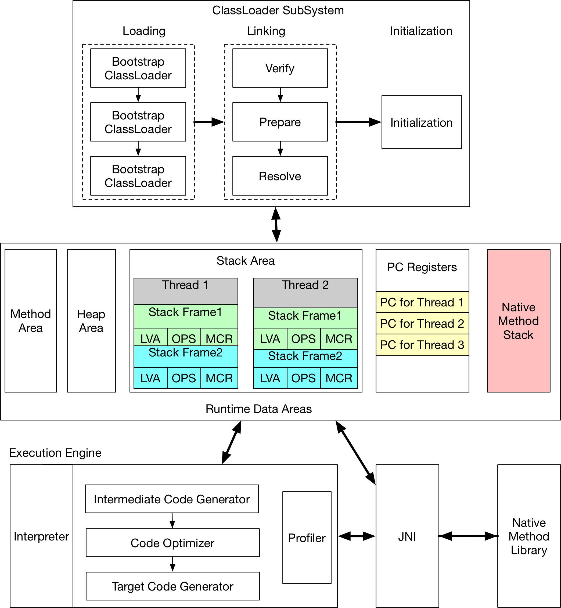

规范只是描述了一个抽象的概念机器，真实的实现者只需要能正确解析class文件并且正确的执行其中的操作就行了，至于内存的布局、垃圾收回算法的选择等都可以随意发挥。

# 1. Run-Time Data Areas
有些区域是JVM级别的：启动时创建，退出时销毁；有些区域是线程级的: 线程创建时创建，线程销毁时销毁。

### 1.1 PC寄存器 Per Thread
线程当前执行的方法，如果不是native，那么pc中保存的就是正在执行的JVM指令的地址(or next ?)，如果是native方法，那么pc值是未定义的。

### 1.2 JVM Stacks Per Thread
创建线程时会同步的创建该线程 __私有__ 的JVM Stack，Stack里面保存的是frames。Stack的作用：保存局部变量，临时结果等，并且对Stack的操作只有push(frame)和pop(),因此frames可以在堆上分配。Stack的内存不要求连续，并且可以是固定大小或者动态分配。

frame如果翻译成中文可以叫方法帧，每当一个方法被调用时，就会创建它的frame，push to stack；当该方法结束时（包括正常执行结束和异常)，它的frame会被销毁，pop from stack。thread在同一时刻只能执行一个方法中的代码，当前执行方法的frame在栈顶，因此栈顶的frame叫current frame,对应的方法叫current method。

frame的大小在编译期就可以确定，其保存如下内容: 

* local variable array
* operand stack(操作数栈)
* 当前method所属class的run-time constant pool

#### local variable array，编译期可以确定大小
```java
---------
| slot0 |
---------
| slot1 |
---------
| slot2 |
---------
|  ...  |
---------
| slotn |
---------
```
一个slot可以存放`boolean, byte, char, short, int, float, reference, returnAddress`类型的数据，但是`long, double`需要两个slot。

如果是实例方法，slot0用来存储`this`，从slot1开始存储方法的参数，和其他临时变量。对于static方法，从slot0开始存储方法的参数，和其他临时变量。

#### Operand Stack 栈的深度在编译期可知
当frame刚创建时，Operand Stack是空的，有一些JVM指令会把常量、本地变量的值、字段push到Operand Stack中，其他一些指令会从Operand Stack中pop出操作数，然后把结果push到栈中。传给方法的参数和从方法接收的返回值也是先放在栈中的。比如`2 + 3`这个操作，对应的指令是`iadd`，执行过程中栈的变化如下：

1. 初始时，栈是空的
```java
------
|    |  
------
|    | 
------
| .. | <--
------
```
2. push(2) to stack
```java
------
|    |  
------
|  2 | <-- 
------
| .. |
------
```
3. push(3) to stack
```java
------
|  3 | <--  
------
|  2 |  
------
| .. |
------
```
4. pop() && pop()
```java
------
|    |  
------
|    | 
------
| .. | <--
------
```
5. push(结果) to stack
```java
------
|    |  
------
|  5 | <-- 
------
| .. |
------
```
必须使用正确的指令来操作栈中的元素，比如栈中保存的是两个`int`，那么`ladd`就不行。有一小部分JVM指令(如dup何swap)不关心操作数的类型，把所有运行时数据区中的数据当做raw type来操作。JVM对这些指令的限制：不可以用来修改数据，也不可以拆散那些原本不可拆分的数据；这些限制通过class文件的校验过程来强制保证。

每次push或者pop操作的是一个entry，一个entry可以放下所有的数据类型，包括`long, double`。栈的深度是它包含的unit个数，`long, double`需要使用两个unit，其他类型使用一个unit。

#### Dynamic Linking
截止到Jdk 8，Java依然只有动态链接。每个frame包含一个指向该方法所属类的run-time constant pool 用来支持动态链接。在class文件里，一个方法调用其他方法或者访问其他变量都是通过symbolic reference来表示。动态链接就是把方法的符号引用转换成对方法的直接引用，把对变量的访问变成对运行时storage offset的访问，如果遇到as-yet-undefined sysbols，那就需要加载对应的class。


### 1.3 Heap JVM级别
堆空间不要求连续。

### 1.4 Method Area JVM级别
Method Area用来存放编译后的字节码，类似于C语言中的代码段(text segment)， 内存空间不需要连续。其中每一个类使用一个structure，保存了run-time constant_pool, field and method data, and the code for methods and constructors, including the special methods used in class and interface initialization and in instance initialization。

run-time contant pool is a per-class or per-interface run-time representation of the constant_pool table in a class file。它包含了几种类型的常量，从在编译器可知的数字字面量，到运行时必须解析的方法或者字段的引用，类似于C语言的符号表。每一个run-time constant pool存储在Method Area中，当JVM创建一个类或者接口时就会构建它的run-time constavnt pool。

在JVM规范中(JVM 9及之前)定义“Method Area在逻辑上是Heap的一部分”，但是Method Area具体存放在哪里、使用什么样的管理方式都由实现者决定，比如一个简单的实现：Method Area既不需要GC，也不需要压缩。

### 1.5 Native Method Stacks
本地方法栈就是通常所说的C栈，用来支持native方法，通常也是Thread级别的。

# 2 JVM Architecture
